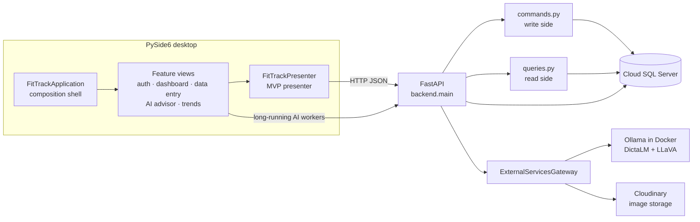
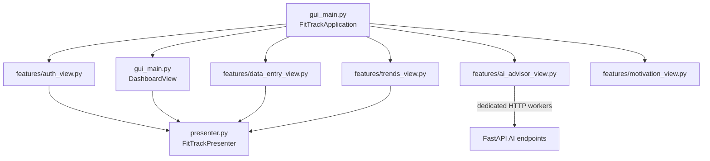
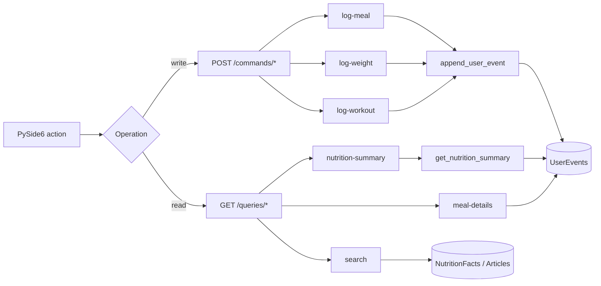
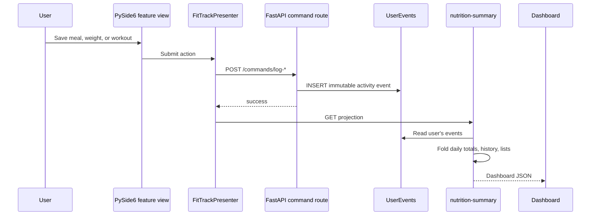
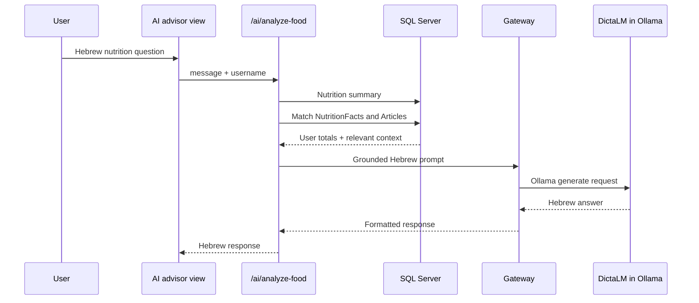
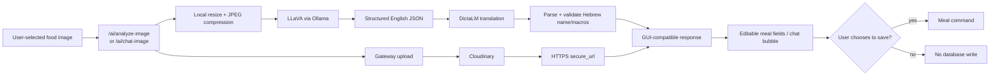

# FitTrackAI Architecture

This document describes the implemented project, including deliberate
lightweight interpretations used for a university desktop application.

## Overall system

`backend/main.py` is the FastAPI composition root. It registers routers,
orchestrates database context for AI prompts, and delegates external calls to
the canonical Gateway.

## Desktop feature modules and MVP

The desktop interpretation of microfrontends is feature-sliced ownership:
each module contains a real `QWidget` feature and its workers, while one shell
composes them into a single process. It is intentionally not a separately
deployed web-microfrontend system.

MVP is applied pragmatically:

- **View:** feature widgets and `DashboardView`.
- **Presenter:** `FitTrackPresenter`, which coordinates primary user actions
  and API requests.
- **Model:** backend JSON projections and SQLAlchemy entities accessed through
  the API.
- AI workers call `/ai/*` directly to avoid blocking the GUI and are documented
  as a deliberate presenter bypass.

## CQRS request split

This is a CQRS-inspired HTTP boundary. Commands and queries have different
routes and responsibilities but intentionally share the same SQL Server and
SQLAlchemy models; no command bus or second database is claimed.

## User activity event log and projection

Event Sourcing is limited to user activity. Command handlers append events and
do not update earlier events; `get_nutrition_summary` folds the log into a read
projection. Users, nutrition facts, and articles remain normal relational
tables. Production features such as snapshots and schema upcasting are outside
the course-scale scope.

## AI advisor and RAG

The RAG implementation uses deterministic SQL keyword retrieval rather than a
vector database. It is appropriate for the small existing corpus and has been
validated with known nutrition and article records.

## Food image and Cloudinary flow

The original image is uploaded without paid transformations. A compressed copy
is generated locally for model inference. A successful response includes the
Cloudinary `secure_url`; model failures cannot masquerade as successful
zero-valued meals.

## Gateway boundary

`backend/gateway.py` owns:

- Cloudinary configuration and upload;
- Ollama text and vision calls;
- AI response parsing and structured nutrition validation;
- optional OpenFoodFacts lookup.

FastAPI routes do not contain provider-specific HTTP calls. OpenFoodFacts is
implemented but is not part of a current user-facing flow, so it must not be
presented as a validated feature.

## Deployment boundaries

- PySide6 and FastAPI run as separate local Python processes.
- SQL Server and Cloudinary are remote services.
- Ollama runs locally in the official Docker image on port 11434.
- Model files are stored in the named Docker volume
  `fittrackai-ollama-data`.
- Secrets are supplied at runtime through environment variables.
