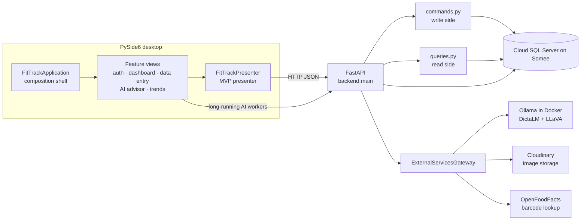
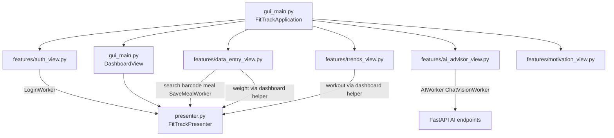
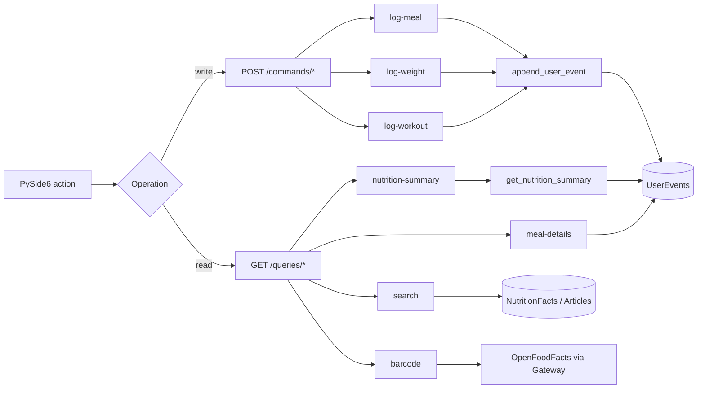
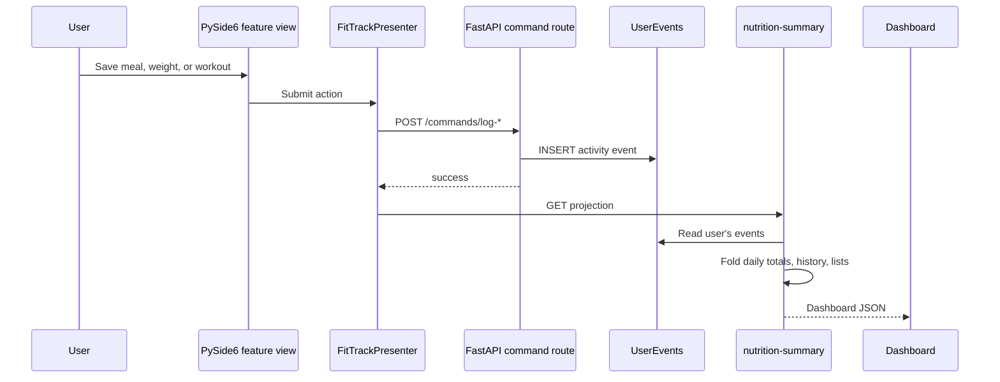
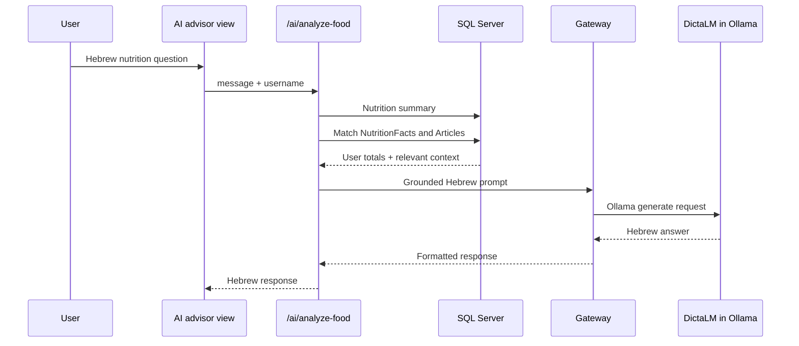
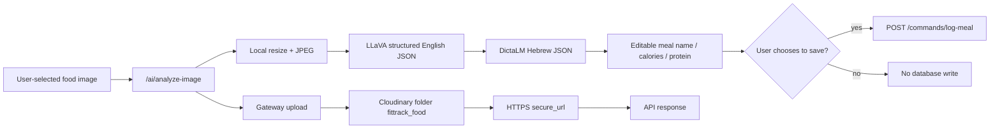
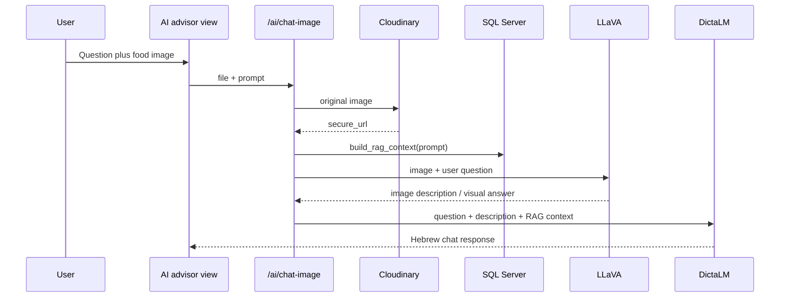

# FitTrackAI Architecture

This document describes the implemented project, including deliberate
lightweight interpretations used for a university desktop application.

## Current request flow

```text
PySide6 Views  (features/* and DashboardView)
        |
        |  login, meals, search, barcode, weight, workout, dashboard reads
        v
Presenter  (presenter.py)
        |
        |  LoginWorker / SaveMealWorker when the call must stay off the UI thread
        v
FastAPI  (backend/main.py)
        |
        +--> Commands  (commands.py)  --> UserEvents insert
        +--> Queries   (queries.py)   --> SQL Server reads / barcode lookup
        +--> AI routes                --> RAG context + Gateway
                    |
                    v
              ExternalServicesGateway
                    |
                    +--> Ollama (DictaLM, LLaVA)
                    +--> Cloudinary
                    +--> OpenFoodFacts
```

Workers are Qt background helpers. They do not replace the presenter. Login and
meal saving currently go View → Presenter → Worker → FastAPI. Weight and
workout saves go View → Presenter → FastAPI on the UI thread. AI advisor and
image workers call `/ai/*` directly so long Ollama inference does not sit in
the presenter.

## Overall system



`backend/main.py` is the FastAPI composition root. It registers routers,
builds RAG context for AI prompts, and delegates provider HTTP to the Gateway.

## Desktop feature modules and MVP



The desktop interpretation of microfrontends is feature-sliced ownership:
each module contains a real `QWidget` feature and its workers, while one shell
composes them into a single process. These are not separately deployed web
microfrontends.

MVP is applied as follows:

- **View:** feature widgets and `DashboardView`.
- **Presenter:** `FitTrackPresenter` coordinates login, dashboard reads,
  search, barcode lookup, meal save, weight, and workout.
- **Model:** SQLAlchemy entities plus FastAPI JSON projections. The desktop
  does not open SQL Server itself.
- **Workers:** `LoginWorker` and `SaveMealWorker` keep slow HTTP off the UI
  thread. AI feature workers are a documented presenter bypass for inference.

Not every feature uses the identical chain. Motivation quotes are local. AI
chat does not go through the presenter.

## CQRS request split



This is a CQRS-inspired HTTP boundary. Commands append activity; queries read
or look up data. Both sides share one SQL Server and one ORM. There is no
command bus and no separate read database. Barcode lookup is a query-side
external read and does not mutate `UserEvents`.

## User activity event log and projection



Event Sourcing is limited to user activity. Command handlers append events and
do not update earlier events; `get_nutrition_summary` folds the log into a read
projection. Users, nutrition facts, and articles remain normal relational
tables. Snapshots and event upcasting are outside this course-scale scope.

Meal saving uses `SaveMealWorker` before the command HTTP call. Weight and
workout currently perform that HTTP call on the UI thread.

## AI advisor and RAG



RAG is deterministic SQL keyword retrieval over `NutritionFacts` and
`Articles`, not a vector database. It is appropriate for the small corpus and
has been validated with known nutrition and article records.

## Food image analysis

Used from Data Entry (`העלה תמונה לניתוח AI`) through `POST /ai/analyze-image`.



Unreliable or zero-calorie vision results are rejected instead of being shown
as a successful meal.

## Image chat

Used from the AI advisor: the user types a question, then chooses
`📷 תמונה`. The GUI sends the image and prompt to `POST /ai/chat-image`.



Image chat is not the structured meal-analysis pipeline. Changing the question
for the same image changes the answer. RAG context is included in the DictaLM
prompt; retrieval is still the existing SQL keyword matcher.

## OpenFoodFacts barcode lookup

```mermaid
sequenceDiagram
    participant User
    participant Entry as Data Entry
    participant Presenter
    participant Query as GET /queries/barcode
    participant Gateway
    participant OFF as OpenFoodFacts

    User->>Entry: Enter barcode and חפש ברקוד
    Entry->>Presenter: lookup_barcode
    Presenter->>Query: barcode
    Query->>Gateway: get_external_nutrition_data
    Gateway->>OFF: product JSON
    OFF-->>Entry: name, calories, protein
    Entry->>Entry: Fill meal form
    Note over Entry: No UserEvents write until שמור ליומן
```

Missing products return HTTP 404. Invalid barcodes return HTTP 400. Provider
failures return HTTP 503. The form is populated for review; the user must
still save explicitly.

## Gateway boundary

`backend/gateway.py` owns:

- Cloudinary configuration and upload;
- Ollama text and vision calls;
- AI response parsing and structured nutrition validation;
- OpenFoodFacts barcode lookup.

FastAPI routes do not contain provider-specific HTTP URLs.

## Deployment boundaries

- PySide6 and FastAPI run as separate local Python processes.
- SQL Server on Somee and Cloudinary are remote services.
- Ollama runs in the official Docker image on port `11434`.
- `compose.yaml` sets `gpus: all` so a host NVIDIA GPU can be used when Docker
  GPU passthrough is available.
- GPU acceleration was validated on the current development laptop with partial
  layer offload because of 4 GB VRAM. Teammates without NVIDIA GPU support can
  still run Ollama on CPU; it is slower.
- Model files are stored in named volume `fittrackai-ollama-data`.
- Secrets are supplied at runtime through environment variables.
